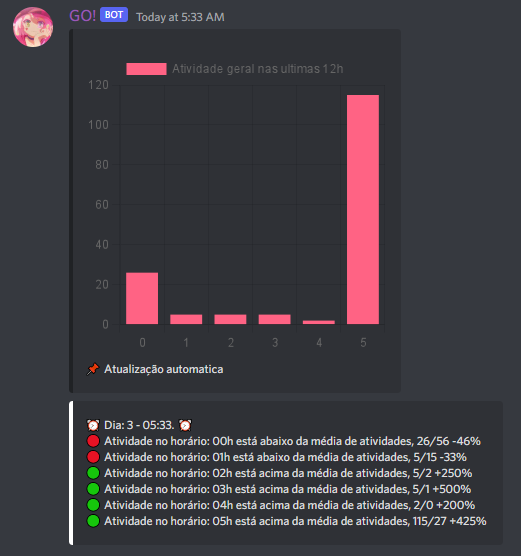

# Chart.js-node [template]

## Integrantes: <a href="https://www.linkedin.com/in/joao-vitor-ribeiro-de-lima-dev/">João Vitor Ribeiro</a>

## Descrição
📜 Apenas um template para aqueles que quiserem utilizar o chart.js fora de um navegador
 
### 📸 Exemplo de uma aplicação que utiliza chartJS
 

💡 O projeto aumenta a visibilidade da biblioteca chart.js para usuarios de NodeJS
 
## 🛠 Estrutura de pastas
-Raiz 
| 
|-->imagens 
|-->src 
| readme.md 
| package.json 
| package-lock.json

## 💻 Configuração para Desenvolvimento

1 - Faça o download do NodeJS e clone este repositório.

3 - Abra sua IDE

3 - No terminal selecione a pasta onde descompactou este repositório.

4 - Execute o comando `node install chart.js chartjs-canvas-node`

5 - Edite o arquivo `app.js` na pasta src e tá pronto o sorvetinho!

Para abrir este projeto você necessita das seguintes ferramentas:

--> <a href="https://nodejs.org/">NodeJS</a>
## 🗃 Histórico de lançamentos

(A cada atualização os detalhes devem ser lançados aqui.)

* 1.0.0 - 01/01/2022
    * Arquivos do tutorial salvos

## 📋 Licença/License

<a property="dct:title" rel="cc:attributionURL" href="https://github.com/Spidus/Teste_Final_1">MODELO GIT INTELI</a> by <a rel="cc:attributionURL dct:creator" property="cc:attributionName" href="https://www.yggbrasil.com.br/vr">INTELI, VICTOR BRUNO ALEXANDER ROSETTI DE QUIROZ</a> is licensed under <a href="http://creativecommons.org/licenses/by/4.0/?ref=chooser-v1" target="_blank" rel="license noopener noreferrer" style="display:inline-block;">Attribution 4.0 International</a>

## 🎓 Referências

Aqui estão as referências usadas no projeto.

1. <https://github.com/Intelihub/Template_M1>
2. <https://nodejs.org/>
3. <https://www.npmjs.com/package/chartjs-node-canvas>
4. <https://www.chartjs.org/>
5. <https://www.w3schools.com/js/js_es6.asp>